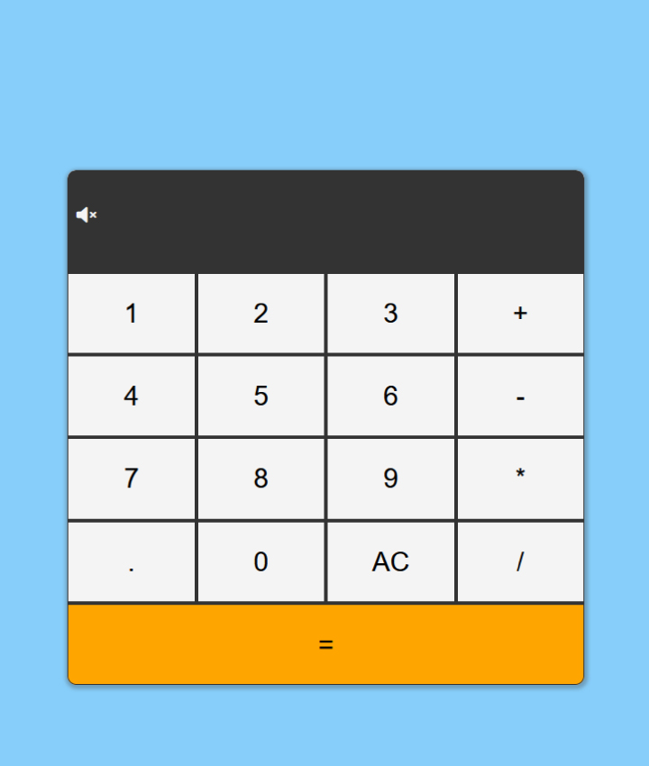

# Calculator

 

I tried to build this calculator in the very first months of my JavaScript journey,
and it was really hard. But after a certain time and lot of practice in between, I was able to 
finish it without a lot of trouble.

Inputs are picked up as strings and concatinated to each other, until the '=' button is pressed.
Then the string is splitted, operators and operands are parsed, all of the calculations are 
performed, and result is displayed.

All of the buttons produce sound when clicked, clear button and equals button have their unique sound.
There is the speaker icon in the left side of the display, where user can mute/unmute calculator key sounds.
Also, sounds can be muted by pressing 'm' or 'M' keys on the keyboard, and unmuted by pressing 'u' or 'U'.

All numerical inputs from the keyboard will work also, '=' button is attached to 'Enter'('Return') keys  
and the '=' key as well. User can clear inputs on 'Backspace', 'Clear' and 'Delete' keyboard keys.

Operations with floating point numbers are possible also, user can input them with or without leading zero.
For the sake of simplicity, maximum length of output(result) decimal places is reduced to 4.
It tried a lot to prevent irregular inputs, but if you are creative enough, it is still possible to receive 'NaN' or
'Infinity' as result.
